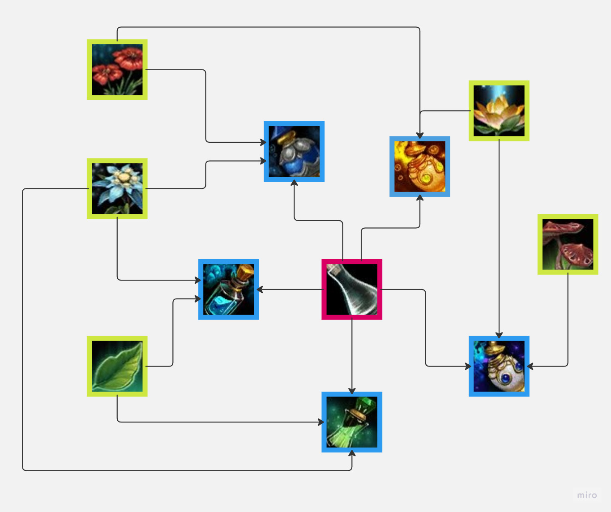
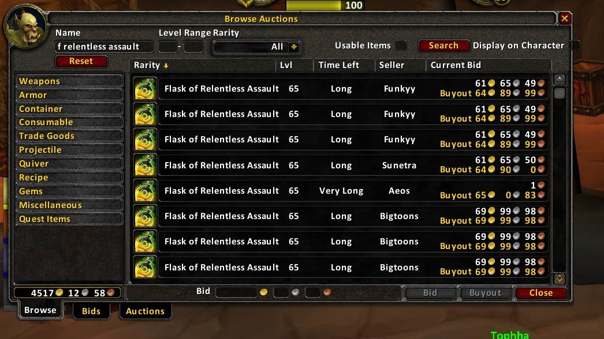
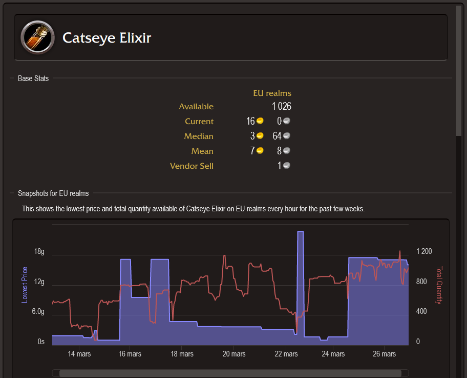

# 📈 World of Warcraft Auction House Forecasting

## Introduction

This project aims at providing a forecasting model for the World of Warcraft Auctions house.

The model is based on a Temporal Graph Neural Network.

>__Why Temporal? :__ Because we want to forecast prices at the auction house, using time series of the previous prices.

> __Why Graph? :__ Because we want to use the explicit links that exist between different product in the game. (e.g. An object in World of Warcraft may be created from a list of components, creating a direct relation between prices of these components and the object itself).    

While predicting the real stock market has been proven to be near impossible, predicting the auction prices in a video game where most explicative variables are fewer and almost all known to us seems way more realistic.

## 📂 Data 

Two sources of data are used for this project.

### 1. Component <-> Product data

This source of data is used in order to create the graph that links products and components to each other. This will be used as the backbone for the GNN.

Products (such as elixirs in the following figure) can be crafted using materials.

>The data comes from the famous [Wowhead](www.wowhead.com) wiki website.

### 2. Time series data

This source of data is used for the prices of all products in the auction house.

In World of Warcraft, one of the main way to acquire materials is through using the Action House, a common market place for players to buy and sell objects.

Prices fluctuate across time and are monitored by specialist websites, allowing to access the evolution across time, for different servers in the game.

> The data comes from [The Undermine Journal](https://theunderminejournal.com/) and its SQL database. No longer freely available today 😔.

## ⚡️ Model

The model used was inspired by an early bike usage prediction model for London shared bikes.

This model was build using the [PyG library](https://pytorch-geometric.readthedocs.io/en/latest/).
